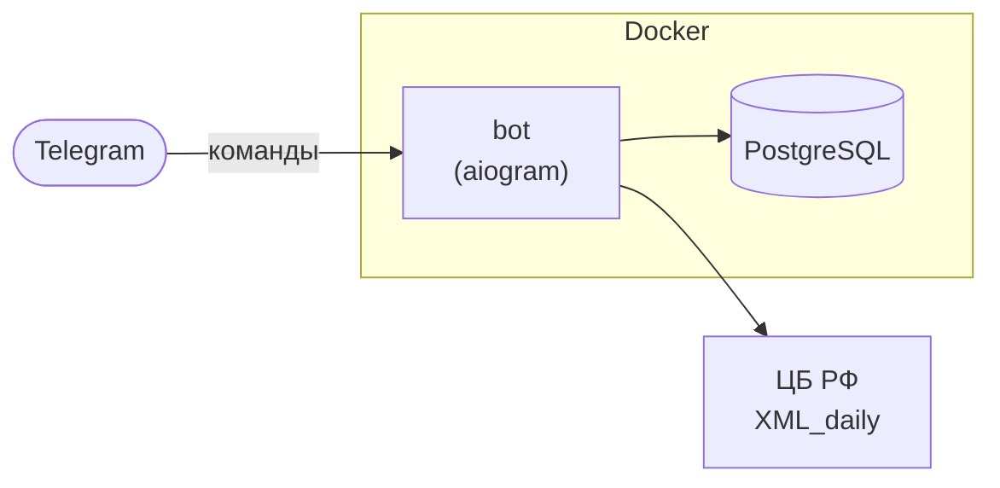

# Currency Compass Bot

<div align="center">
  

[](https://github.com/BlasterAlex/currency-compass-bot/actions/workflows/ci.yml)

[](https://github.com/astral-sh/ruff)
</div>

Telegram-бот для определения выгодного момента покупки иностранной валюты за российские рубли.

Показывает официальный курс Банка России по валютам, которые пользователь выбирает сам. Операции покупки не выполняет:
курс ЦБ - ориентир, а не цена в банке.

### Возможности

- **Список валют:** поиск по коду ISO или русскому названию из дневного фида ЦБ
- **Текущий курс:** цена за номинал ЦБ и за 1 единицу, если номинал не равен 1
- **Флаги стран:** рядом с кодом валюты для быстрого чтения
- **Меню команд:** `/start`, `/currencies`, `/rate` в меню Telegram

### Команды

| Команда       | Описание                              |
|---------------|---------------------------------------|
| `/start`      | О боте и список команд                |
| `/currencies` | Управление списком валют              |
| `/rate`       | Текущие курсы ЦБ по выбранным валютам |

---

## Архитектура



`bot` обрабатывает команды пользователя. Курсы берутся из дневного XML Банка России и кэшируются в памяти. Выбор валют
хранится в PostgreSQL.

---

## Локальный запуск

**Нужно:** Docker, Docker Compose, Make.

```bash
# 1. Клонировать репозиторий
git clone https://github.com/BlasterAlex/currency-compass-bot.git
cd currency-compass-bot

# 2. Создать deploy/.env
cp deploy/.env.example deploy/.env
# указать BOT_TOKEN

# 3. Запустить db + migrate + bot
make dev

# 4. Остановить
make cleanup
```

`make dev` собирает образ и поднимает контейнеры в фоне. Миграции выполняются автоматически через сервис `migrate`.

---

## Тесты

Тесты запускаются в Docker на отдельной тестовой базе - локальный Python не обязателен.

```bash
make test
```

Сборка образа, временный PostgreSQL, прогон тестов и выход. Отчёт покрытия пишется в `coverage.xml`.

Локально (нужен `DATABASE_URL` для integration):

```bash
pytest tests/unit/                 # unit-тесты без БД
pytest tests/integration/          # integration-тесты с БД
pytest tests/unit/test_cbr.py -v   # один файл
```

Линт:

```bash
make lint
```

---

## Переменные окружения

Создайте `deploy/.env` перед запуском. Все переменные обязательны, если не указано иное.

| Переменная     | Описание                                                    | По умолчанию |
|----------------|-------------------------------------------------------------|--------------|
| `BOT_TOKEN`    | Токен Telegram-бота от [@BotFather](https://t.me/BotFather) | -            |
| `DATABASE_URL` | Строка подключения PostgreSQL (драйвер asyncpg)             | -            |
| `LOG_LEVEL`    | Уровень логов (`DEBUG`, `INFO`, `WARNING`, `ERROR`)         | `INFO`       |

Пример `deploy/.env`:

```dotenv
BOT_TOKEN=123456:ABC-DEF...
DATABASE_URL=postgresql+asyncpg://currency_compass:currency_compass@db:5432/currency_compass
LOG_LEVEL=DEBUG
```

---

## Деплой

```bash
docker compose -f deploy/docker-compose.prod.yml pull
docker compose -f deploy/docker-compose.prod.yml up -d
```

Prod-compose берёт образ из GHCR (`ghcr.io/blasteralex/currency-compass-bot:latest`).
Миграции выполняются автоматически перед стартом `bot`.

Публикация GitHub Release запускает workflow: сборка образа, push в GHCR и деплой по SSH в `/opt/currency-compass-bot`.

Нужные секреты репозитория: `VPS_HOST`, `VPS_USER`, `VPS_SSH_KEY`.

Подробнее: [`deploy/README.md`](deploy/README.md).
